<!-- _header: '' -->


# **agent based modelling @ cnz**

lessons from modelling the GB target of 600,000 heat pumps by 2028 using an ABM

---


# 👋 **hey, i'm ryan**

#### 👇 about me 👇

* 📈 data science @ krakenflex
* 🧠 works on domestic asset optimisation - heat pumps [hp], electric vehicles [ev], solar & storage (batteries)
* 🤝 worked @ cnz before

---

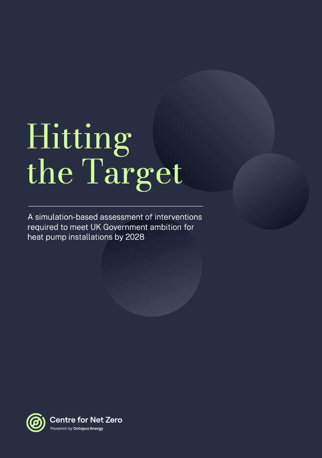

# CNZ Report: Hitting the target

📌 **Goal:** _what combination of policy interventions are required to meet the UK target of 600,000 HPs by 2028?_

---

# Agenda

1. [What is an agent based model?](#5)
2. [How did we build the model?](#13)
3. [What did we learn?](#19)
4. [Any questions?](#27)

---

# Agenda

1. [**What is an agent based model?**](#5)
2. [How did we build the model?](#13)
3. [What did we learn?](#19)
4. [Any questions?](#27)

---

# What is an agent based model (ABM)?


---

# An agent based model needs

1. `Agent`s, which we considered to be a `Household`

2. `Environment`, which dictates _costs, incentives_ etc

3. `Rules`, for how the agents _interact with each other and the environment_ at each timestamp

At each timestep, the environment evolves according to the rules, and the agents respond to the environment.

---

### Our approach centred on households as the key decision maker

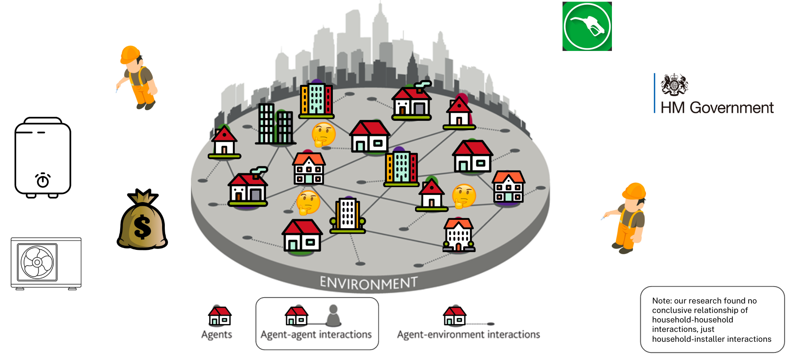

---

# like code? same :)

<div class="columns">
<div>

This is what an agent looks like in the code.

You can make them with

```python
agents = [Household(**household) for household in households]
```

and then add them to the environment

</div>
<div>

```python
class Household(Agent):
    def __init__(
        self,
        id: int,
        location: str,
        property_value_gbp: int,
        total_floor_area_m2: int,
        is_off_gas_grid: bool,
        construction_year_band: Optional[ConstructionYearBand],
        property_type: PropertyType,
        built_form: BuiltForm,
        heating_system: HeatingSystem,
        heating_system_install_date: datetime.date,
        epc_rating: EPCRating,
        potential_epc_rating: EPCRating,
        occupant_type: OccupantType,
        is_solid_wall: bool,
        walls_energy_efficiency: int,
        windows_energy_efficiency: int,
        roof_energy_efficiency: int,
        is_heat_pump_suitable_archetype: bool,
        is_heat_pump_aware: bool,
    ):
```

</div>
</div>

---

# the `Environment` was similar

<div class="columns">
<div>

```python
class DomesticHeatingABM(AgentBasedModel):
    def __init__(
        self,
        start_datetime: datetime.datetime,
        step_interval: relativedelta,
        # ... some other stuff ...
        interventions: Optional[List[InterventionType]],
        # ... some other stuff ...
        price_gbp_per_kwh_gas: float,
        price_gbp_per_kwh_electricity: float,
        price_gbp_per_kwh_oil: float,
        air_source_heat_pump_price_discount_schedule: Optional[
            List[Tuple[datetime.datetime, float]]
        ],
        heat_pump_installer_count: int,
        heat_pump_installer_annual_growth_rate: float,
        annual_new_builds: Optional[Dict[int, int]],
    ):
```

</div>

We made assumptions globally about how the "world model" evolved. These were parameters, so we could change them and run lots of scenarios.

</div>
</div>

---

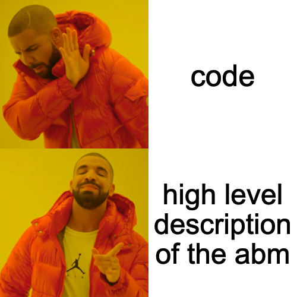

---

# Agent decision making loop

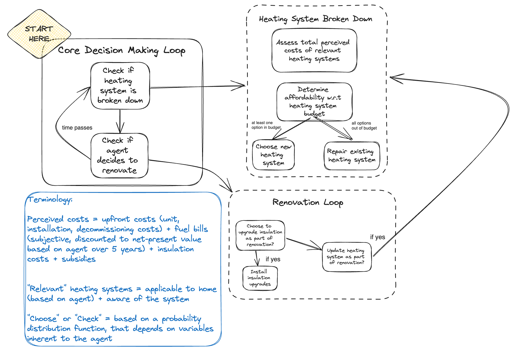

---

# Agenda

1. [What is an agent based model?](#5)
2. [**How did we build the model?**](#13)
3. [What did we learn?](#19)
4. [Any questions?](#27)

---

# ABM Architecture Diagram

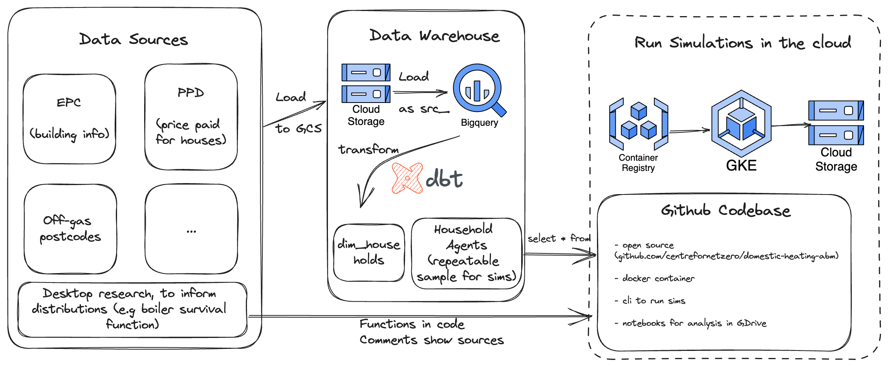

---

# Development pipeline

* ~~We~~Dani did a literature review of the "key" behaviours we want to model. As you'll see later, only worry about the big stuff.
* **Test-driven development**: write the _test of expected behaviour_ then add the feature as code.
* Check how it impacted our _key metric_ (HPs installed)
* Sensitivity analysis (see later)
* Run a notebook of graphs to check results against scenarios

---

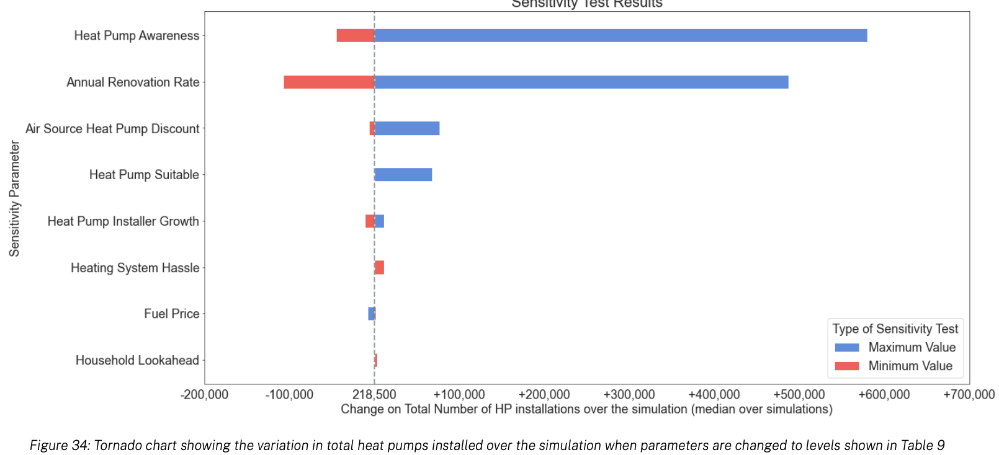

**Technical: The model is sensitive to awareness and upfront costs**

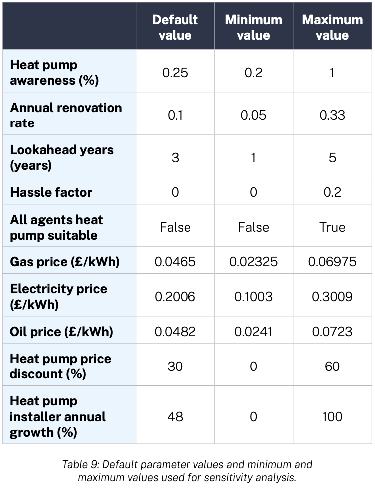

---

**Technical: How we calibrated and validated the ABM**

Show that you can recreate a historical dataset with default parameters. We used RHI uptake from 2010 - 2021.
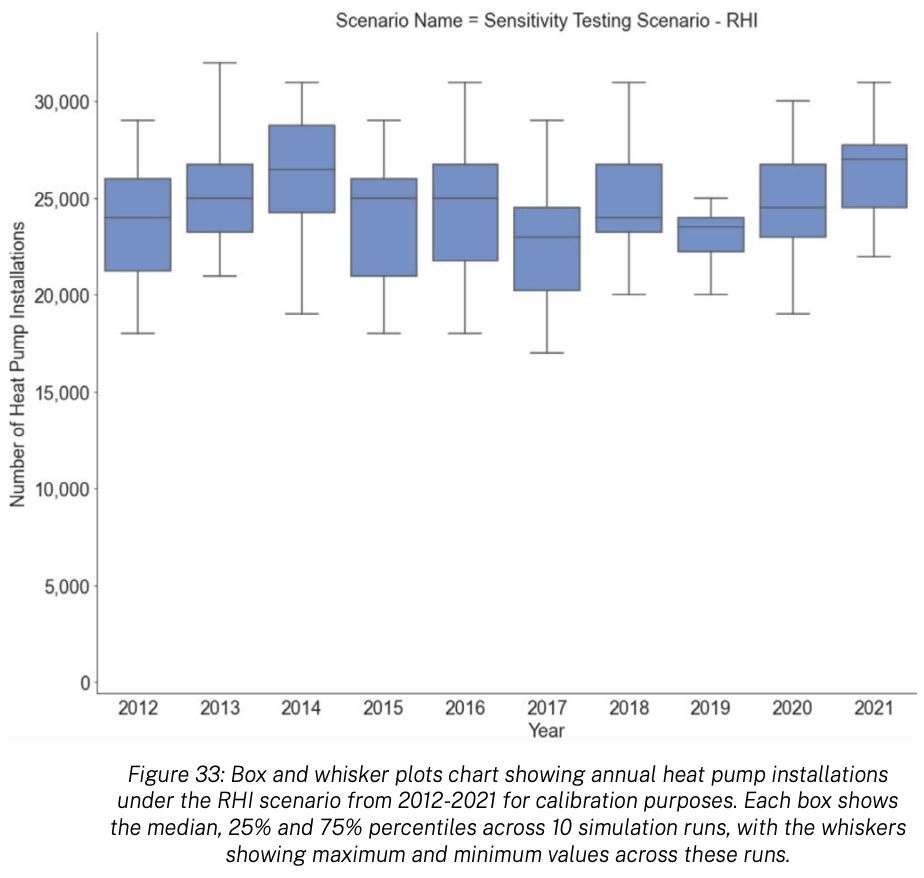

---

#### Scenarios were agreed with our policy team

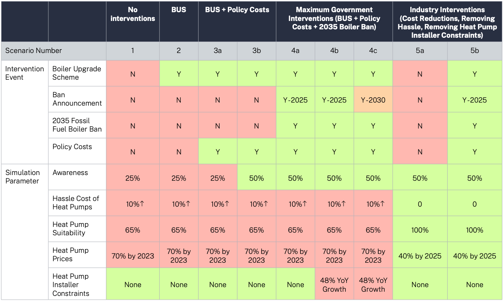

---

# Agenda

1. [What is an agent based model?](#5)
2. [How did we build the model?](#13)
3. [**What did we learn?**](#19)
4. [Any questions?](#27)

---
<style scoped>
table {
  font-size: 16px;
}
</style>

# Our Findings

| Area | Description of Finding |
| --- | --- |
| **Upfront costs** | Present the biggest barrier to adoption by our household agents. Even in our most ambitious projections, the upfront cost of a HP is still 1.5- 2 times more expensive than an equivalent boiler in the short-medium term.  |
| **Awareness** | Our model is most sensitive to awareness and rate of renovation; changing these values leads to a large increase in the cumulative HP installations over the time period simulated. |
| **Resolving Friction** | Renovation is most important trigger for agents to purchase new heating systems. Resolving frictions a household experiences with changing heating system type in a ‘near-breakdown’ scenario, especially if property type and insulation are sufficient is important to meeting targets is important for avoiding lock-in to fossil fuel systems. |
| **Boiler Ban** | Of scenarios that enable us to reach the Government’s target, the early announcement of a fossil fuel boiler ban with a commencement date of 2035 is crucial to driving uptake. |
| **Policy costs** | Redistribution of policy costs does not materially change the number of HP installations since upfront costs outweigh the future running costs of a heating system in a household’s decision-making. |
| **Training** | Training more HP installers is necessary to meet demand in the short-medium term. Our simulations suggest 30,000 HP installers are required by 2028, a tenfold increase on today’s numbers and approx a quarter of existing Gas Safe installers. Failure to do so will lead to medium term capacity constraints in 2025/27. |

---

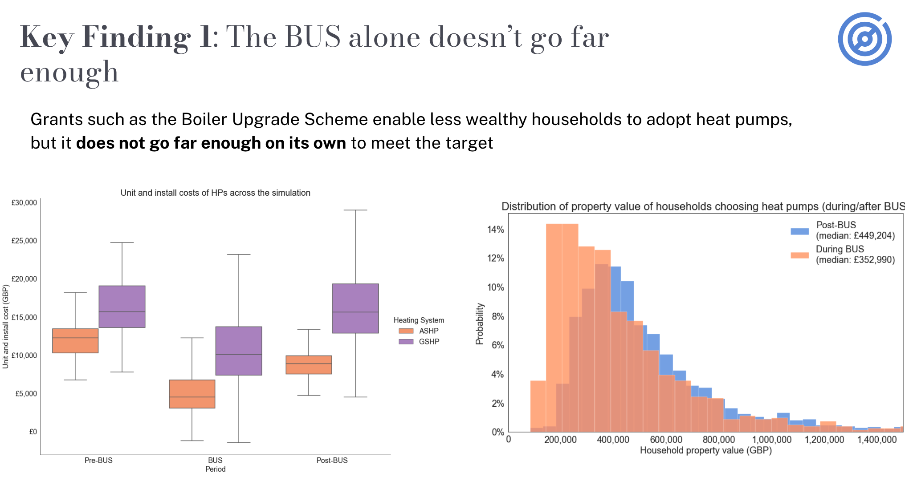

---

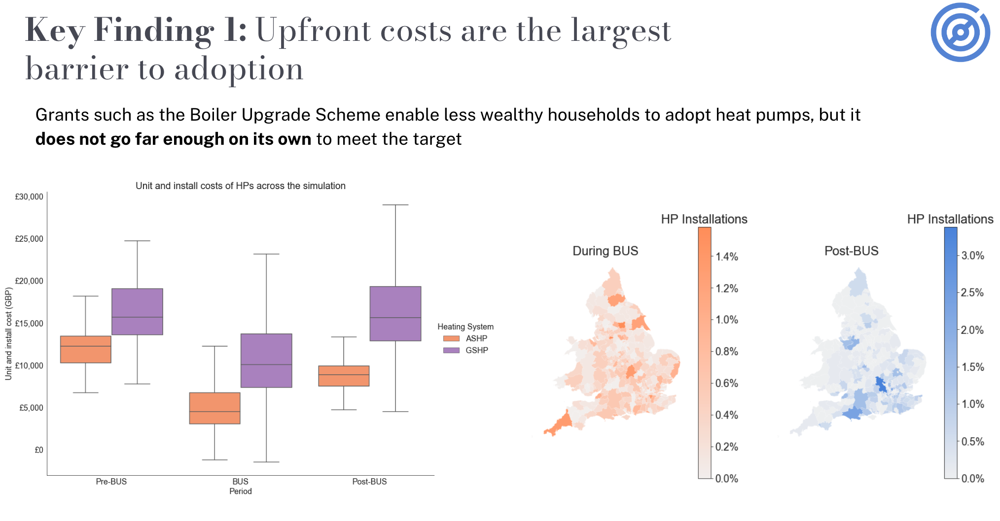

---

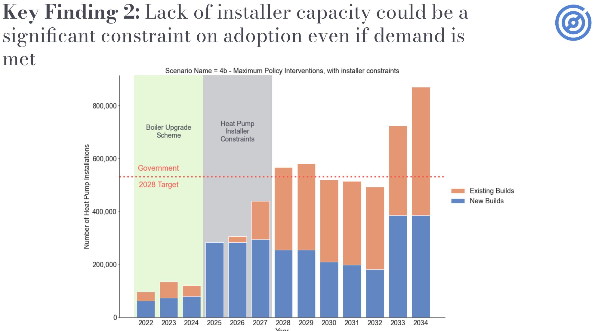

---

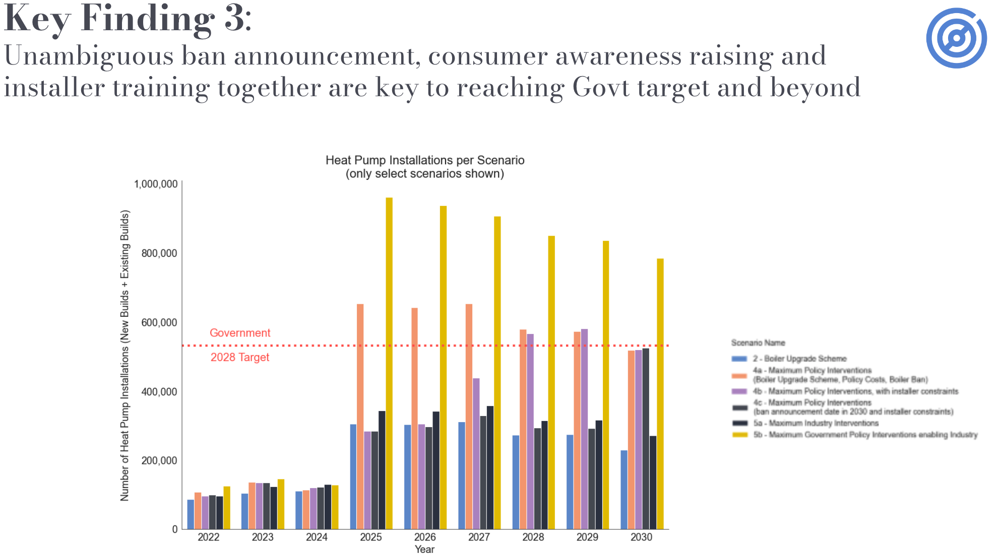

---

# Recommendations to Policymakers

1. Take a longer-term view of upfront costs
2. Launch a public awareness campaign on decarbonising home heating
3. Set an unambiguous time frame for the phase out of fossil fuel heating systems as early as possible
4. Prioritise efforts to grow heat pump installer numbers

---


# Stuff we learnt

<style scoped>
section {
  font-size: 30px;
}
</style>

* Everything you add to the model is an assumption. **Add as little as possible**, because you'll have to justify everything and you want a model you can explain. You _can_ have too many things going on.
* Writing ABM code is easy. Knowing what to add and running it at scale is hard. **Stand on the shoulders of giants, using data and techniques that already exist**.
* **Sensitivity analysis** is key towards seeing what would swing the output. Only focus on the big stuff (both inputs & outputs of a model).

---

# Agenda

1. [What is an agent based model?](#5)
2. [How did we build the model?](#13)
3. [What did we learn?](#19)
4. [**Any questions?**](#27)
